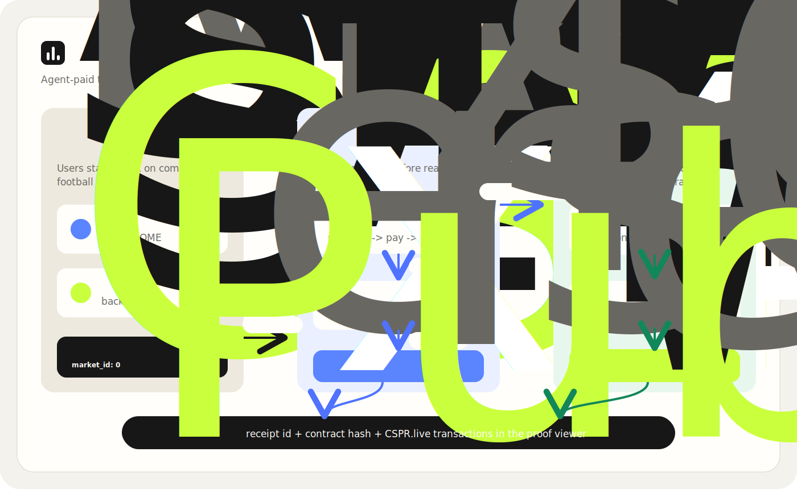

# Arbiter

**Autonomous settlement for the agent economy, on Casper.**

Arbiter is an autonomous agent that pays for a verified real-world outcome over
**x402**, settles the resulting obligation **on-chain**, and leaves a
**cryptographic proof trail** linking the payout to the receipt it paid for.

The live vertical is a **parimutuel football market**: stakers back an outcome,
the agent pays an x402 endpoint for the verified result, and the market settles
and pays out — with the x402 receipt referenced on-chain. The same engine
generalises to cross-border (corridor) settlement as a second adapter.

Built for the **Casper Agentic Buildathon 2026** (Casper Innovation Track).

---

## Judge quick path

If you only have a few minutes, review these in order:

1. **What it does:** Arbiter is an agent-run settlement workflow. It pays a
   truth endpoint for a result, submits that result to a Casper testnet
   contract, settles the market, and publishes the proof trail.
2. **Proof it ran:** see [SUBMISSION.md](./SUBMISSION.md) for the deploy,
   `create_market`, `submit_resolution`, and `settle` transaction links.
3. **Visual walkthrough:** run `npm run web` and open the local proof viewer.
4. **Demo script:** use [docs/DEMO_SCRIPT.md](./docs/DEMO_SCRIPT.md) for the
   2-3 minute video walkthrough.
5. **Requirement coverage:** see [docs/JUDGE_PACKET.md](./docs/JUDGE_PACKET.md)
   for the submission audit and evidence checklist.

Live Casper testnet proof:

| Step | Evidence |
|---|---|
| Contract deployed | [`73510503...a48`](https://testnet.cspr.live/transaction/73510503b81826ef4d2a78a9068888acc453a971c2eb325f493289816bf81a48) |
| Market created | [`b50fe93...0b6`](https://testnet.cspr.live/transaction/b50fe93cc706fab4ee5fd0c64884e524322c7b803d2eb4aca089e261b0a7a0b6) |
| Agent submitted resolution | [`1bfb353...43c`](https://testnet.cspr.live/transaction/1bfb353ffd9440f2e06fdbc86639c15804d3db1865c2f3f7db6ea7eb7b55443c) |
| Agent settled market | [`3b75366...83c`](https://testnet.cspr.live/transaction/3b75366a3d15e20b069e4b1df39450f03ddf38a6d9829c4930ba416f37d6a83c) |
| Contract | [`contract-11ee...3f6`](https://testnet.cspr.live/contract/11ee76f57a0c9c119e340329b3b507619bd07948b4e488dafdc250a3ce7203f6) |
| x402 proof reference | `x402:rcpt_35bb5efd4a6948d5` |

**Current prototype honesty:** the truth endpoint implements an x402-shaped
HTTP 402 challenge, signed payment header, receipt, nonce expiry, and replay
protection for the demo. Replacing the local HMAC verifier with the unchanged
Casper x402 facilitator is the next integration step and is tracked in
[PRODUCTION_READINESS.md](./PRODUCTION_READINESS.md).

---

## Why this, not another x402 primitive

The buildathon field is crowded with x402 *infrastructure* — receipt
primitives, gateways, kits, credit scores, spending guards. Arbiter is not
another primitive. It is the **working settlement application** that consumes
those primitives: real funds escrowed, a real outcome paid for, a real payout
made. It does something a user feels, and it closes the loop Casper's AI Toolkit
describes — one agent pays a service, acts on the result, and proves it.

---

## Architecture — two on-chain surfaces

Keep these separate; conflating them is what makes the build hard.

**Surface A — paying for truth (x402).** The agent calls the truth endpoint,
receives `402`, signs, and pays. In this submission, the endpoint uses an
x402-compatible demo verifier with nonce expiry and replay protection so the
agent loop can be run deterministically. The production integration path is to
swap that verifier for the unchanged Casper x402 facilitator / CEP-18 flow.

**Surface B — settling the obligation (this contract).** The `ArbiterSettlement`
Odra contract escrows native CSPR, accepts the resolved outcome + an x402 proof
reference from the agent, takes a rake, and pays winners pro-rata. This is the
only bespoke contract.



| Step | What the judge should see |
|---|---|
| 1. Stake | CSPR is escrowed in the `ArbiterSettlement` market pool. |
| 2. Pay for truth | The agent receives an HTTP `402`, signs payment, and receives an x402 proof reference. |
| 3. Resolve | The agent submits the winning side plus `proof_ref` to Casper. |
| 4. Settle | The contract snapshots pools, applies rake, and opens winner claims. |
| 5. Prove | The proof viewer links receipt id, contract hash, and public CSPR.live transactions. |

---

## Repo layout

```
arbiter/
├── contracts/                  # Surface B — Odra settlement contract (Rust)  [DONE]
│   ├── src/arbiter_settlement.rs   # the contract + tests
│   ├── src/lib.rs
│   ├── Cargo.toml · Odra.toml · build.rs · rust-toolchain
│   └── bin/                        # wasm + schema build entrypoints
├── truth-endpoint/             # Surface A — x402-style outcome resolver       [DONE]
├── agent/                      # the Arbiter agent loop                        [DONE]
└── web/                        # demo proof viewer                             [DONE]
```

The contract is the spine and it is deployed on Casper testnet. The
truth-endpoint and agent are implemented as a small dependency-free demo loop:
the endpoint issues an x402-style HTTP 402 challenge, the agent pays it, receives
a proof reference, then calls `submit_resolution` and `settle` on Casper.

---

## The settlement contract

`ArbiterSettlement` — parimutuel, native-CSPR settlement.

**Entrypoints**

| Fn | Who | Effect |
|---|---|---|
| `init(resolver, treasury, rake_bps)` | deployer | sets the agent (resolver), treasury, and rake (bps, ≤1000) |
| `create_market(close_time) -> u64` | admin | opens a market, returns its id |
| `stake(market_id, side)` *(payable)* | anyone | escrows attached CSPR on a side, before `close_time` |
| `submit_resolution(market_id, winning_side, proof_ref)` | resolver | records the outcome + the x402 receipt reference |
| `settle(market_id)` | resolver | snapshots pools, sends rake to treasury, opens claims |
| `claim(market_id)` | winners | pulls pro-rata share of the post-rake pool |
| `set_resolver(resolver)` | admin | rotates the agent key |
| `get_market / get_pool / get_stake / get_total / get_resolver / market_count` | view | reads |

**Payout math (parimutuel).** Winners split the entire pool minus rake, pro-rata
to their winning-side stake:

```
rake        = total_pool * rake_bps / 10_000
payout_pool = total_pool - rake
your_payout = your_stake * payout_pool / winning_pool
```

If nobody backed the winning side, the whole pool routes to the treasury.

**Proof linkage.** `submit_resolution` stores `proof_ref` (the x402 receipt id)
in market state and re-emits it in the `Settled` event — this is the on-chain
end of the "prove" step that ties the payout to the truth the agent paid for.

**Design notes / hardening for the Final Round.** Settlement is pull-based
(`claim`) to avoid unbounded loops — production-safe by construction. The
resolver is a single provisioned key today (account abstraction is not yet
shipped on Casper); rotate via `set_resolver`. For the corridor vertical, swap
native-CSPR escrow for a CEP-18 settlement token via an `External<Erc20...>`
reference.

**Events:** `MarketCreated, Staked, Resolved, Settled, Claimed`.
**Errors:** `40_000–40_008` (Unauthorized, MarketNotFound, MarketNotOpen,
StakingClosed, ZeroStake, MarketNotResolved, MarketNotSettled, NothingToClaim,
InvalidRake).

---

## Build, test, deploy

Requires the Casper/Odra toolchain (the pinned nightly installs automatically
from `rust-toolchain`).

```bash
# one-time
cargo install cargo-odra --locked
rustup target add wasm32-unknown-unknown

cd contracts

# run the test suite (fast native VM)
cargo odra test

# run against the Casper execution engine backend
cargo odra test -b casper

# build the deployable wasm
cargo odra build
# -> wasm/ArbiterSettlement.wasm
```

Run the prototype checks:

```bash
npm run check
```

Run the local demo services:

```bash
npm run truth
npm run demo:dry-run
npm run web
```

Demo flow:

1. Start the truth endpoint with `npm run truth`.
2. In another terminal, run `npm run demo:dry-run` to show the agent receiving a
   `402`, signing the payment payload, receiving a verified result, and printing
   the proof receipt without spending testnet gas.
3. Run `npm run web` and open the proof viewer to show the already completed
   testnet deploy, market creation, resolution, settlement, contract hash, and
   x402 receipt reference.
4. For the live on-chain run, use `npm run agent` with a funded Casper testnet
   key and the environment values in `.env.example`.

The included tests cover the full happy path (stake → resolve → settle → claim,
with rake and pro-rata math asserted to the mote), double-claim rejection, and
the resolver/admin access checks.

**Deploy to Testnet:** build the wasm above, then deploy with `casper-client
put-deploy` (or Odra's livenet flow) against `https://node.testnet.casper.network`,
passing the runtime args `resolver`, `treasury`, `rake_bps`. See the Odra
livenet docs for the deployment harness.

---

## Status & timeline

The buildathon is two-phase. **Qualification closes June 30**; to advance on the
merit path you need a working Testnet prototype that produces an on-chain
transaction — this contract is that component. The **Final Round (July 6–19)** is
the jury contest, where the truth-endpoint, agent loop, demo video, brand, and
launch narrative get hardened.

- [x] Surface B — settlement contract + tests (this repo)
- [x] Surface A — x402-style truth endpoint
- [x] Arbiter agent loop — perceive → pay → reason → settle → prove
- [x] Testnet deployment + on-chain app interactions
- [x] Demo proof viewer + submission writeup
- [ ] Short demo recording
- [ ] Swap demo x402 verification for the unchanged Casper x402 facilitator
